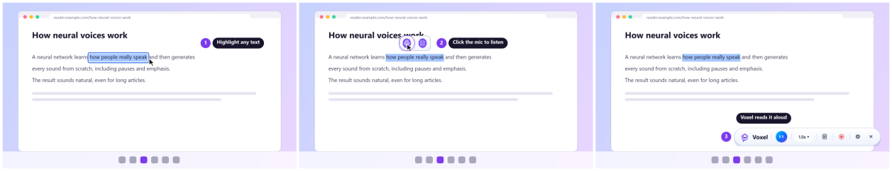
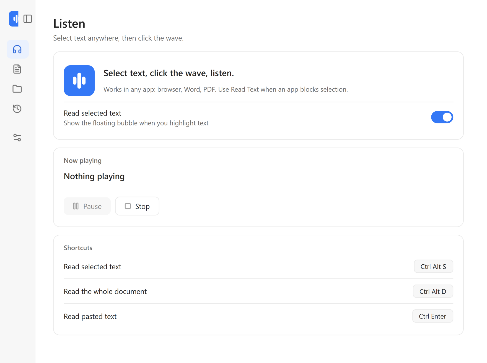
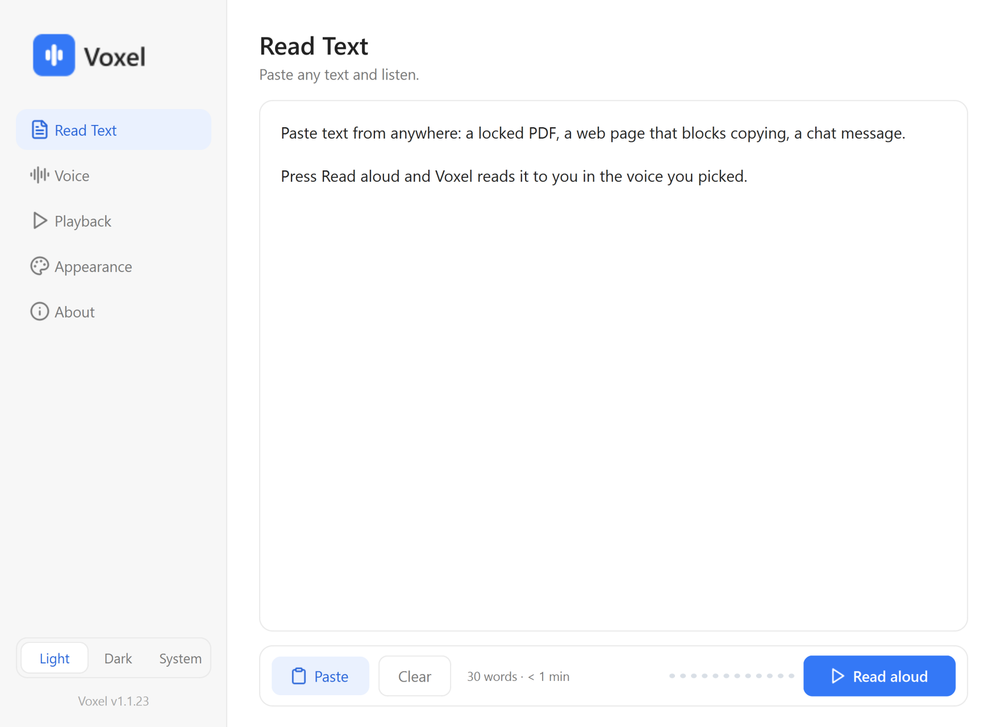
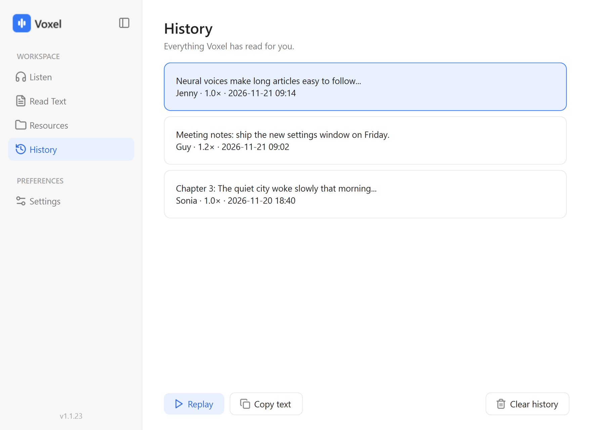
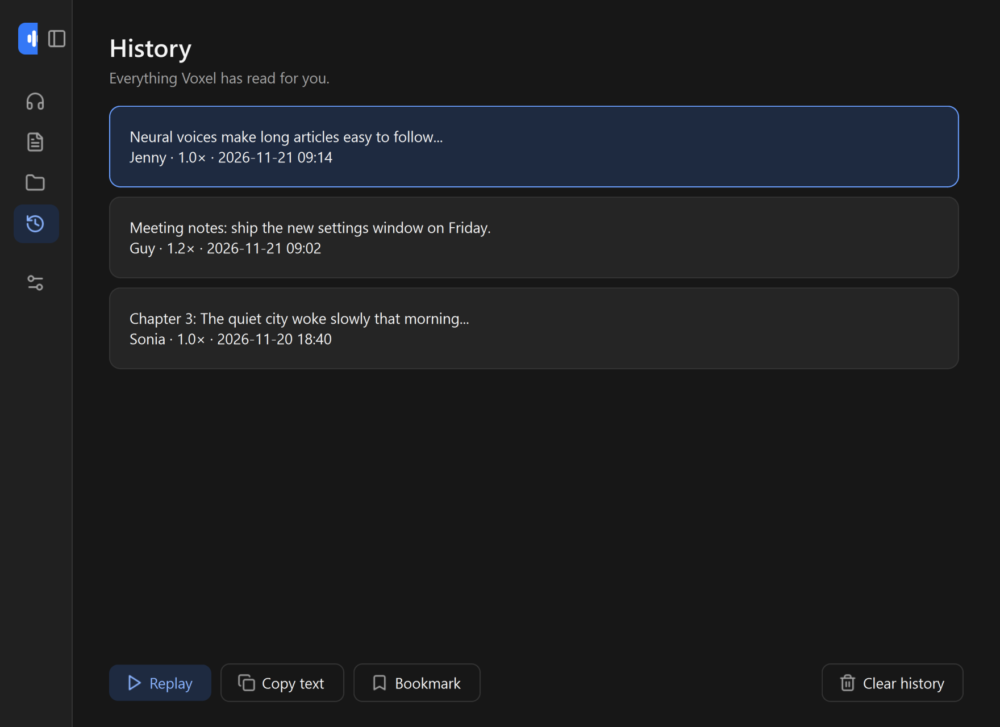
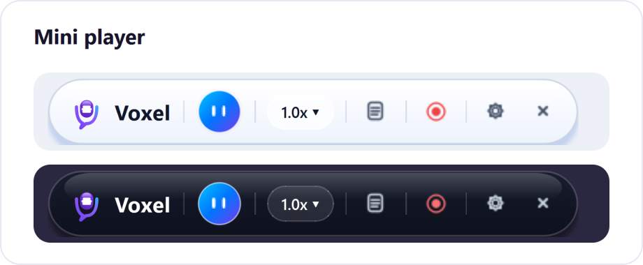
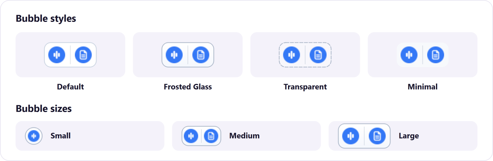

<p align="center">
  
</p>

<h1 align="center">Voxel</h1>
<p align="center"><b>Select text anywhere. Hear it instantly.</b><br>Free text-to-speech for Windows & macOS, a <a href="https://www.digimo.pt/">Digimo</a> product.</p>

<p align="center">
  <a href="https://github.com/Digimo2020/Voxel-/releases/latest"></a>
  <a href="https://github.com/Digimo2020/Voxel-/releases"></a>
  <a href="LICENSE"></a>
</p>

<p align="center">
  <a href="https://github.com/Digimo2020/Voxel-/releases/download/v1.1.24/Voxel-v1.1.24.exe"></a>
  &nbsp;
  <a href="https://github.com/Digimo2020/Voxel-/releases/download/v1.1.24/Voxel-v1.1.24.dmg"></a>
</p>

---

## How it works

<p align="center">
  
</p>

📖 **[Visual how-to guide →](docs/HOW_TO_USE.md)** (every screen explained with pictures)

## Features

- 🎙 **Natural voices**: Microsoft Edge neural voices, with offline fallback (macOS Speech / Windows SAPI)
- 🫧 **Never steals focus**: the bubble sits on top of your work without interrupting it
- 📄 **Read whole documents** with one click
- 📝 **Read Text**: paste text from apps that block selection and listen
- 🔖 **Keep things**: save texts, bookmark what you heard, find recordings in Resources
- 🎚 **Your pace**: speed, pitch, volume and equalizer presets
- 🌗 **Light, dark and frosted-glass** themes; small / medium / large bubble sizes

## A look around

| Listen | Read Text (paste anything) |
| :---: | :---: |
|  |  |
| **History** | **Dark theme** |
|  |  |

<p align="center">
  
  &nbsp;
  
</p>

## Install

**Windows**: download `Voxel-v1.1.24.exe`, run it. If SmartScreen warns, choose *More info → Run anyway*.

> **Windows says "Smart App Control blocked an app"?** The test builds are not code-signed yet. Don't turn Smart App Control off. Run from source with `run.bat` (see below), or follow the [signing and Microsoft Store plan](docs/WINDOWS_STORE_GUIDE.md).

**macOS**: open the `.dmg`, drag Voxel to Applications, then run once in Terminal:

```bash
xattr -cr /Applications/Voxel.app
```

Then allow Voxel under *System Settings → Privacy & Security → Accessibility*.

**From source**

```bash
pip install -r requirements.txt
python main.py
```

## Tech

Python 3.11 · PyQt6 · pynput · edge-tts · pypdf · PyInstaller · GitHub Actions

## More

[How to use](docs/HOW_TO_USE.md) · [Full details](docs/DETAILS.md) · [Windows signing & Store](docs/WINDOWS_STORE_GUIDE.md) · [Privacy](docs/PRIVACY.md) · [Changelog](CHANGELOG.md) · [Roadmap](ROADMAP.md) · [Versioning rules](VERSIONING_RULES.md) · [Contributing](CONTRIBUTING.md) · [All releases](https://github.com/Digimo2020/Voxel-/releases)

<p align="center"><sub>MIT License · Made by Digimo</sub></p>
